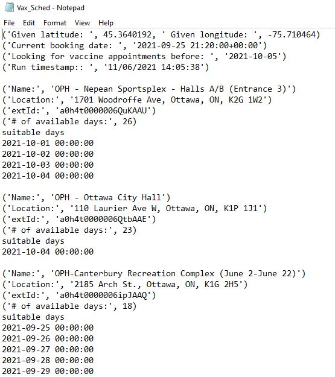

# Ottawa Covid 19 second dose scheduler
## Overview
The purpose of this tool is to automate the process of re-booking second doses on a local system. The tool is unable to secure the booking by itself, but it allows the user to immediately view a list of possible vaccine locations and dates. Following this feedback, the user can personally secure a vaccine appointment in the empty slot the tool desiplays.

This tool is envisoned to be a server side application that sends users notifications about available vaccine slots at regular daily intervals. This removes the need for a user to manually check the vaccine rebooking site for dosage slots.

## Requirements
The tool is meant to run as a windows batch file. In order to set up the virtual environment needed to run the tool, install and set up anaconda on the local device, then create a virtual environment like so:

> conda env create -f environment.yml

Once the environment is created, fill in the appropriate sections of the Config.json file. You will need to input your email, confirmation code and preferred appointment date. The tool only shows available dates before the preferred appointment date. 

Finally, edit the script call in .bat file from 'Config-dev.json' to 'Config.json' with the correct details when running on local

## Technical details
TBD

## Sample output

    

## Future work
1) Allow users to pass latitude and longitude values to the tool instead of defaulting to downtown Ottawa

2) Currently, the tool is set to run locally and display available timeslots in a .txt file. Future development will include the ability to periodically send the timeslot updates via email for ease of use. 
